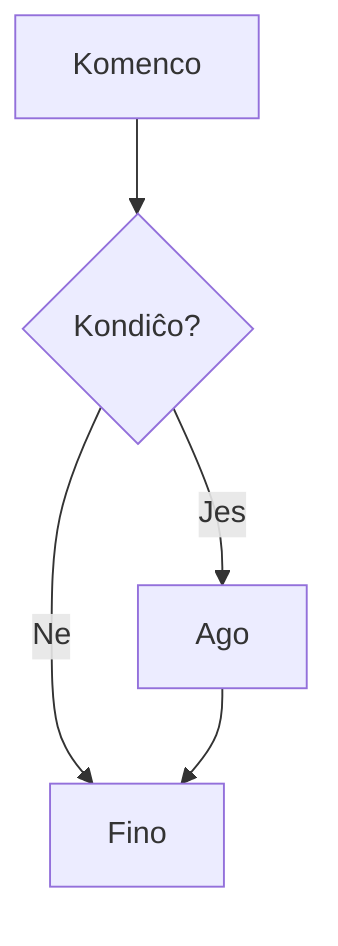
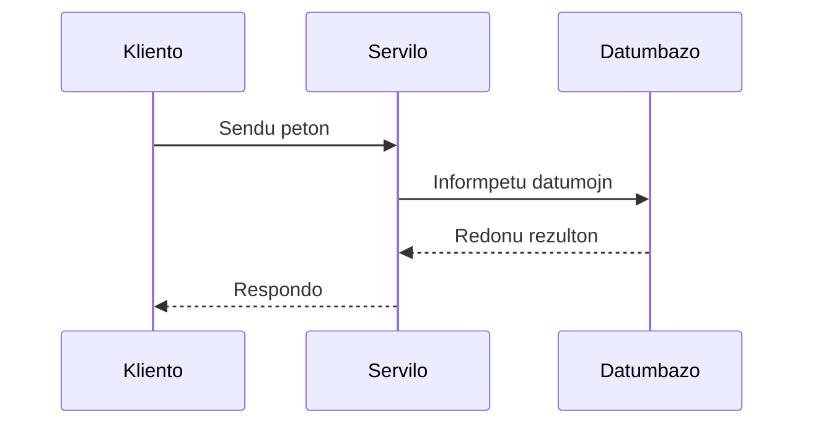
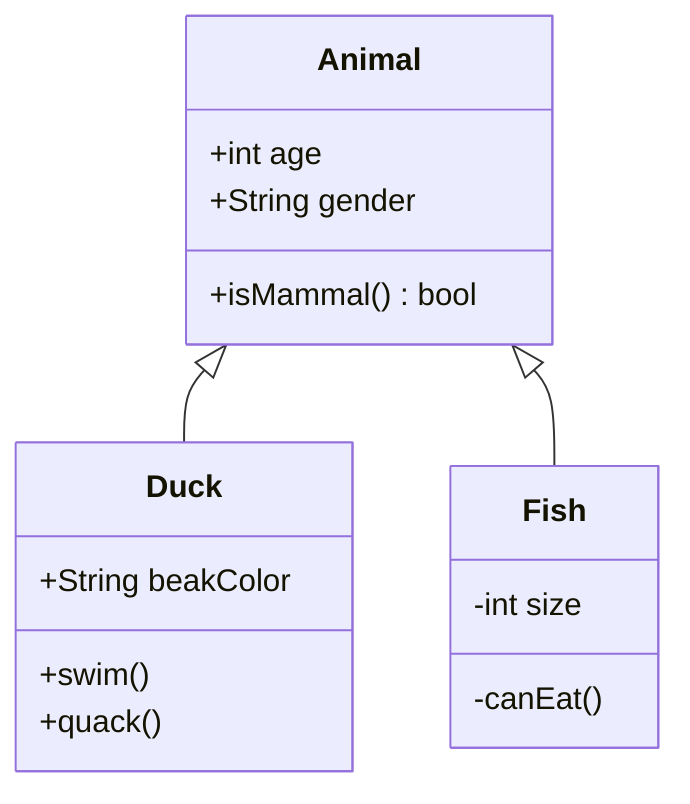
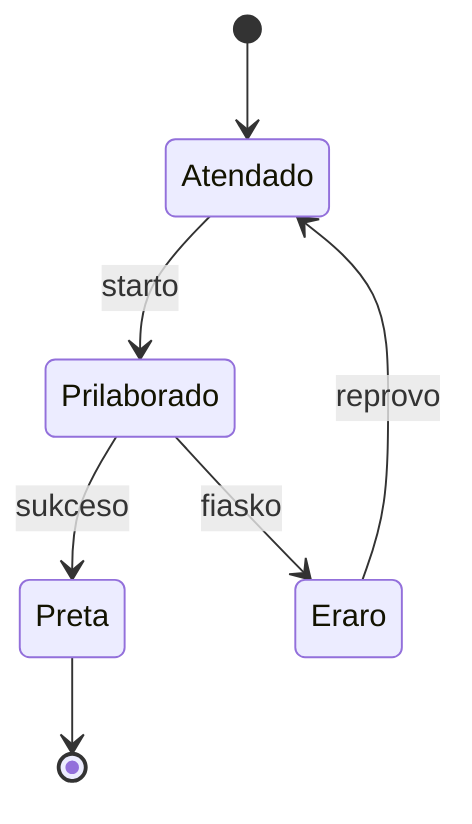

## Bonvenon al Mia Blogo

Jen la unua Esperanto-artikolo. Plurlingvaj funkcioj nun estas agorditaj:

- **中文** (zh) — Defaŭlta lingvo
- **English** (en)
- **日本語** (ja)
- **Русский** (ru)
- **Esperanto** (eo)

Ĉi tiu blogo estas konstruita per Astro 6, subtenas malhelan/helan teman ŝaltadon (Gruvbox-paletro) kaj estas integrita kun la komenta sistemo Giscus. Kodo-blokoj subtenas sintaksan emfazon, diff-ajn prinotojn kaj dosiernoman montradon. Matematikaj formuloj estas bildigataj per KaTeX, subtenante kaj enliniajn kaj bloknivelajn esprimojn.

Ĉi tiu artikolo celas testi ĉiujn Markdown-sintaksajn bildigojn dum kontrolado de la flosanta enhavtabelo (TOC) tra diversaj scenaroj.

---

## Ĉi Tiu Estas Ekstreme Longa Esperanta Titolo Speciale Dizajnita por Testi TOC-an Tekstan Trunkigon kaj Konsiletojn

La TOC havas fiksitan larĝon de 192px, taŭgigante proksimume 22–24 Latinajn signojn ĉe 14px-tipargrando. Ĉi tiu titolo multe superas tiun longon, do ĝi devus esti trunkita per `...` en la TOC, montrante la plenan titolon ĉe ŝvebo. Malsupre estas ekzempla korpa teksto.

### Simile Longega Tria-Nivela Subtitolo por Kontroli Krommarĝenajn Diferencojn Dum Trunkigo

Tria-nivelaj titoloj havas kroman maldekstran krommarĝenon en la TOC, igante la haveblan larĝon eĉ pli mallarĝa, do trunkigo devus okazi pli frue. Ĉi tiu titolo estas intence multvorta por ekigi superfluan detekton.

---

## Mallongaj Titoloj Estas Bone

Malsupre estas mallongaj titoloj, kiuj devus aperi plene en la TOC sen konsiletoj.

### Mallonga Subtitolo

Ankaŭ montrata plene.

---

## Plurnivela Titola Hierarkia Testo

La TOC nur kaptas h2 kaj h3, sed ĉi tiu artikolo inkluzivas pli profundajn nivelojn por kontroli enartikolan titolan bildigon.

### Tria-Nivela Titolo A

Videbla en la TOC, kun maldekstra krommarĝeno.

#### Kvar-Nivelaj Titoloj Ne Aperas en la TOC

Ili ne aperos en la TOC sed estas normale bildigataj sur la paĝo.

##### Kvin-Nivelaj Titoloj Ankaŭ Ne Aperas

Profundnivelaj titoloj estas nur por struktura testado.

### Tria-Nivela Titolo B

Reen al TOC-videbla nivelo.

---

## Markdown-Sintaksa Superrigardo

Ĉi tiu sekcio sisteme testas la diversajn sintaksajn elementojn subtenatajn de Markdown, de bazaj tekstostiloj ĝis kompleksaj kodo-blokoj kaj matematikaj formuloj.

### Tekstostiloj

Jen **grasa** teksto, jen *kursiva* teksto, jen ***grasa kursiva*** teksto, jen ~~trastreka~~ teksto, kaj jen `enlinia kodo`.

### Ligiloj kaj Bildoj

[Astro Retejo](https://astro.build/) estas la statika reteja generatoro uzata de ĉi tiu blogo.


### Blokcitaĵoj

> Jen blokcitaĵo, uzata por montri la bildigon de citita teksto.
>
> > Jen ingita blokcitaĵo. Teknike ebla, sed devus esti ŝpareme uzata praktike.

Krome, blokcitaĵoj povas esti stiligitaj kiel atentigoj per la sintakso `[!TYPE]`:

> [!NOTE]
> Jen noto &mdash; suplementa informo, kiun la leganto eble trovos utila.

> [!TIP]
> Jen konsileto &mdash; helpema sugesto por fari aferojn pli bone aŭ pli facile.

> [!IMPORTANT]
> Jen grava &mdash; ŝlosila informo, kiun la leganto bezonas scii.

> [!WARNING]
> Jen averto &mdash; urĝa informo, kiu bezonas tujan atenton por eviti problemojn.

> [!CAUTION]
> Jen singardo &mdash; konsilo pri eblaj riskoj aŭ negativaj rezultoj.

---

## Listoj kaj Aranĝo

Listoj estas kerna ilo por organizi informojn.

### Neordigitaj Listoj

- Elemento unu: malferma enhavo
- Elemento du: alia punkto
  - Ingita elemento A: por plia ellaboro
    - Pli profunda ingado ankaŭ estas subtenata
  - Ingita elemento B: alia sub-elemento
- Elemento tri: reen al supra nivelo

### Ordigitaj Listoj

1. Paŝo unu: pravalorizi la projekto-strukturon
2. Paŝo du: agordi dependecojn kaj konstruajn agordojn
3. Paŝo tri: skribi kernan funkcian kodon
    1. Sub-paŝo 3.1 — realigi la datumtavolon
    2. Sub-paŝo 3.2 — realigi komercan logikon
4. Paŝo kvar: skribi testojn por certigi kodo-kvaliton
5. Paŝo kvin: deploji al produkto

### Taskolistoj

- [x] Farita: agordi Astro 6-projekton
- [x] Farita: integri Tailwind CSS v4
- [ ] Farenda: aldoni flosantan TOC-komponanton
- [ ] Farenda: optimumigi paĝan rendimenton
- [ ] Farenda: skribi uzantan dokumentaron
- [ ] Farenda: agordi CI/CD-dukton

---

## Tabeloj kaj Datummontrado

### Baza Tabelo

| Lingvo    | Kodo | Tiparo       | Priskribo                                |
|-----------|------|--------------|------------------------------------------|
| Ĉina      | zh   | Noto Sans SC | Optimumigita por Simpligita Ĉina         |
| Angla     | en   | Noto Sans    | Defaŭlta tiparo por Latinaj signoj       |
| Japana    | ja   | Noto Sans JP | Japanaj kanaoj kaj kanĵioj               |
| Rusa      | ru   | Noto Sans    | Subteno de cirilaj signoj                |

### Kodo-Kompara Tabelo

| Trajto         | JavaScript     | TypeScript       | Python                    |
|----------------|----------------|------------------|---------------------------|
| Tipsistemo     | Dinamika       | Statika          | Dinamika (laŭvolaj hintoj)|
| Rultempo       | Foliumilo/Node | Kompilas al JS   | Interpretilo              |
| Pakaĵadministro| npm/yarn/pnpm  | npm/yarn/pnpm    | pip/poetry                |
| Lernkurbo       | Malalta        | Meza             | Malalta                   |

---

## Kodo-Blokoj

Kodo-blokoj uzas Shiki-sintaksan emfazon, subtenante: defaŭltajn lininumerojn, defaŭltan horizontalan rulumadon, laŭpetan vorto-ĉirkaŭigon kun `wrap` (pendanta krommarĝeno), kodo-faldadon (`collapse`), dosiernomajn etikedojn (`file`), kaj malŝaltadon de lininumeroj (`nolines`).

### Bazaj Prinotoj: Lininumeroj + file

Lininumeroj estas ebligitaj defaŭlte; `file="name"` montras dosiernoman etikedon en la supra-maldekstra angulo.

```python file="fibonacci.py"
def fib(n: int) -> list[int]:
    a, b = 0, 1
    for _ in range(n):
        a, b = b, a + b
    return a
```

### Malŝalti Lininumerojn: nolines

Mallongaj koderpecoj kun `nolines` kaŝas lininumerojn por koncizeco.

```bash nolines
pnpm install
pnpm dev
pnpm build
```

### Faldado + Horizontala Rulumado: collapse

`collapse` aŭtomate faldas longajn kodo-blokojn. Sen `wrap`, tro longaj linioj restas en unu linio kaj uzas horizontalan rulumadon.

```python collapse file="scroll-and-fold.py"
from datetime import datetime


def build_release_report(project: str, commits: list[dict[str, str]], include_review_notes: bool = False, timezone: str = "Asia/Shanghai") -> str:
    """Generate a release report while keeping a long signature for horizontal-scroll testing."""
    lines = [f"# {project} Release Report", f"Generated at: {datetime.now().isoformat()}", ""]
    for commit in commits:
        scope = commit.get("scope", "misc")
        title = commit.get("title", "Untitled commit")
        lines.append(f"- [{scope}] {title} — {commit.get('hash', 'unknown')} — reviewer={commit.get('reviewer', 'none')} — deployment_window={commit.get('window', 'standard')}")
    if include_review_notes:
        lines.append("## Review Notes")
        lines.append("Confirm migration scripts, search indexes, static asset caches, and rollback paths before shipping.")
    return "\n".join(lines)


sample = [{"scope": "build", "title": "Refresh Pagefind index", "hash": "abc123", "reviewer": "Sylvan", "window": "nightly"}]
print(build_release_report("blog.sylvan.cafe", sample, include_review_notes=True))
```

### Vorto-ĉirkaŭigo + Pendanta Krommarĝeno: wrap

Aldonu `wrap` kiam tro longaj linioj devas ĉirkaŭiĝi ĉe la uja limo, kun la daŭrigo krommarĝenigita por vicigi kun la unua linio de kodo.

```python wrap file="wrap-example.py"
def build_query_url(endpoint: str, filters: dict[str, str], include_archived: bool = False, sort: str = "updated_at:desc") -> str:
    return f"{endpoint}?include_archived={include_archived}&sort={sort}&filters=" + "&".join(f"{key}={value}" for key, value in filters.items())
```

### CSS

```css nolines
.astro-code {
  @apply rounded-lg border border-border;
  font-family: var(--font-code);
}

.astro-code .line {
  min-height: 1.5rem;
}
```

---

## Mermaid-diagramoj

La blogo nun subtenas Mermaid-diagramojn — uzu la saman baritan kodosintakson kun la `mermaid` lingvoetikedo. Diagramoj estas bildigitaj al SVG dum konstruado per beautiful-mermaid, uzante CSS-variablojn por aŭtomate adaptiĝi al hela/malhela etoso.

### Fludiagramo



### Sekvencodiagramo



### Klasodiagramo



### Statodiagramo



### Semantikaj Koloroj

Uzu `classDef` kun CSS-variabloj por apliki semantikajn emfazkolorojn al nodoj, aŭtomate adaptiĝante al hela/malhela etoso:

```mermaid
graph TD
    Start[Komenco de konstruado] --> Check{Kontrolo de sintakso}
    Check -->|Sukceso| Build[Konstrui artifakton]
    Check -->|Eraro| Err[Kompila eraro]
    Build --> Test{Ruli testojn}
    Test -->|Sukceso| Deploy[Eliversurmeti]
    Test -->|Eraro| Fix[Ripari kodon]
    Err --> Fix
    Fix --> Check

    classDef ok fill:var(--mermaid-green),color:var(--mermaid-bg)
    classDef err fill:var(--mermaid-red),color:var(--mermaid-bg)
    classDef warn fill:var(--mermaid-yellow),color:var(--mermaid-bg)
    classDef info fill:var(--mermaid-blue),color:var(--mermaid-bg)
    class Start,Build,Deploy ok
    class Err err
    class Fix warn
    class Check,Test info
```

---

## Matematikaj Formuloj

### Enliniaj Formuloj

La maso-energia ekvivalento $E = mc^2$ estas eble la plej fama fizika formulo. La Pitagora teoremo $a^2 + b^2 = c^2$ estas same konata.

### Blokaj Formuloj

La Gaŭsa integralo:

$$
\int_{0}^{\infty} e^{-x^2} dx = \frac{\sqrt{\pi}}{2}
$$

La probablodensa funkcio de la normala distribuo:

$$
f(x) = \frac{1}{\sigma\sqrt{2\pi}} e^{-\frac{(x-\mu)^2}{2\sigma^2}}
$$

La Euler-a identeco:

$$
e^{i\pi} + 1 = 0
$$

### Plurliniaj Formuloj

Uzante la medion `aligned`:

$$
\begin{aligned}
\nabla \times \vec{\mathbf{B}} - \frac{1}{c} \frac{\partial\vec{\mathbf{E}}}{\partial t} &= \frac{4\pi}{c}\vec{\mathbf{j}} \\
\nabla \cdot \vec{\mathbf{E}} &= 4\pi\rho \\
\nabla \times \vec{\mathbf{E}} + \frac{1}{c} \frac{\partial\vec{\mathbf{B}}}{\partial t} &= \vec{\mathbf{0}} \\
\nabla \cdot \vec{\mathbf{B}} &= 0
\end{aligned}
$$

---

## Plilongigitaj Trajtoj

### Piednotoj

Jen frazo kun piednoto.[^1] Jen alia frazo kun piednoto.[^long-note]

[^1]: Jen la enhavo de la piednoto. Piednotoj estas montrataj ĉe la malsupro de la artikolo.

[^long-note]: Jen longa piednoto por testi plurlinian piednotan bildigon. En plurlingva blogo, piednotaj ankroligiloj devas ĝuste trakti vojprefiksojn.

### HTML-Detalpanelo

<details>
<summary>Klaku por etendi</summary>

Jen faldita enhavo, subtenanta Markdown-sintakson.

- Listelemento
- Alia elemento
- Ankoraŭ alia elemento

La detalpanelo povas enhavi plenan Markdown, inkluzive de kodo-blokoj kaj tabeloj.

</details>

### Horizontalaj Reguloj

---

Horizontala regulo uzas tri aŭ pli da streketoj, asteriskoj aŭ substrekoj.

---

## Resumo kaj Perspektivo

Ĉi tiu artikolo sisteme testis ĉiujn Markdown-sintaksojn subtenatajn de la blogo. Per la plurnivela titola strukturo, la sekvaj flosantaj TOC-trajtoj estis kontrolitaj:

- Titolnivela detekto (h2 kaj h3)
- Ruluma emfaza spurrado (IntersectionObserver)
- Glata rulumo ĉe klako (kun deŝova kompenso)
- Plurlingva enhava kongrueco

Estontaj plibonigoj inkluzivas plentekstan serĉon, etikedan nubon kaj RSS-fluon optimumigon.
