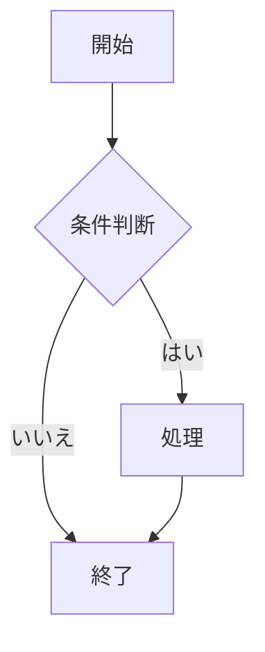
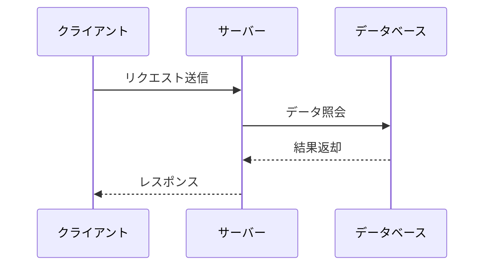
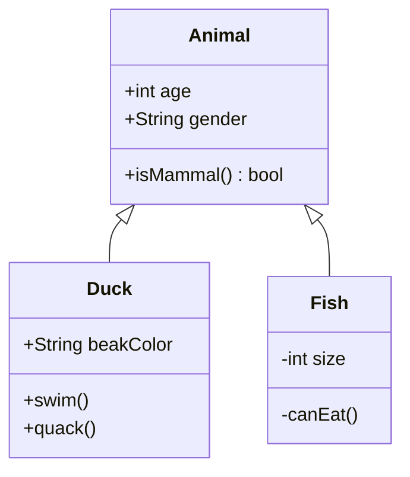
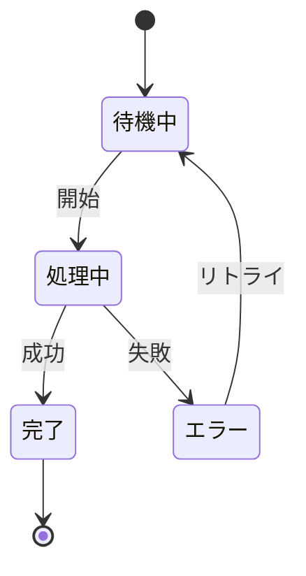

## 私のブログへようこそ

これは最初の日本語記事です。多言語機能が設定されました：

- **中文** (zh) — デフォルト言語
- **English** (en)
- **日本語** (ja)
- **Русский** (ru)

このブログは Astro 6 で構築され、ダーク/ライトテーマ切り替え（Gruvbox パレット）と Giscus コメントシステムを統合しています。コードブロックはシンタックスハイライト、差分表示、ファイル名表示をサポートします。数式は KaTeX でレンダリングされ、インライン数式とブロック数式の両方に対応しています。

本記事ではすべての Markdown 構文のレンダリングをテストし、同時にフローティング目次（TOC）コンポーネントの動作を検証します。

---

## これは TOC コンポーネントのテキスト切り詰めとツールチップ機能をテストするための非常に長い日本語タイトルの例です

TOC の幅は 192px に固定されており、14px のフォントサイズで約13文字の日本語文字が収まります。この見出しはその長さを大きく超えているため、TOC 内では `...` で省略され、ホバー時に完全なタイトルが表示されるはずです。

### 切り詰め時のインデントの違いを検証するための、同じく非常に長い第三レベルのサブ見出し

第三レベルの見出しは TOC 内で追加の左インデントが付くため、実際の利用可能幅はさらに狭くなり、より早く切り詰めが発生します。

---

## 短い見出しは正常

以下は短い見出しであり、TOC 内でツールチップなしで完全に表示されるべきです。

### 短いサブ見出し

同じく完全に表示されます。

---

## 多階層見出しテスト

TOC は h2 と h3 のみを収録しますが、本記事にはより深い階層も含まれており、記事内の見出しレンダリングを検証します。

### 第三レベル見出し A

TOC に表示され、左インデントが付きます。

#### 第四レベル見出しは TOC に表示されない

TOC には表示されませんが、ページ上では通常通りレンダリングされます。

##### 第五レベル見出しも同様に表示されない

深い階層の見出しは構造テスト用です。

### 第三レベル見出し B

再び TOC 表示階層に戻ります。

---

## Markdown 構文の概要

このセクションでは、基本的なテキストスタイルから複雑なコードブロックや数式まで、Markdown がサポートするさまざまな構文要素を体系的にテストします。

### テキストスタイル

これは**太字**テキスト、これは*斜体*テキスト、これは***太字斜体***テキスト、これは~~打ち消し線~~テキスト、これは`インラインコード`です。

### リンクと画像

[Astro 公式サイト](https://astro.build/) はこのブログで使用している静的サイトジェネレーターです。


### 引用

> これは引用テキストです。多言語ブログにおいて、引用のスタイルは一貫しているべきです。
>
> > これは入れ子引用です。技術的には可能ですが、実際の執筆では可読性のために控えめに使用すべきです。

---

## リストとレイアウト

リストは情報を整理するための中核的なツールです。

### 番号なしリスト

- 項目1：冒頭の内容
- 項目2：別のポイント
  - 入れ子項目 A：詳細説明用
    - より深い入れ子もサポート
  - 入れ子項目 B：別のサブ項目
- 項目3：トップレベルに戻る

### 番号付きリスト

1. ステップ1：プロジェクト構造の初期化
2. ステップ2：依存関係とビルド設定の構成
3. ステップ3：コア機能コードの作成
    1. サブステップ 3.1 — データ層の実装
    2. サブステップ 3.2 — ビジネスロジックの実装
4. ステップ4：テストの作成とコード品質の確保
5. ステップ5：本番環境へのデプロイ

### タスクリスト

- [x] 完了：Astro 6 プロジェクトの設定
- [x] 完了：Tailwind CSS v4 の統合
- [ ] 未完了：フローティング TOC コンポーネントの追加
- [ ] 未完了：ページパフォーマンスの最適化
- [ ] 未完了：ユーザードキュメントの作成
- [ ] 未完了：CI/CD パイプラインの設定

---

## テーブルとデータ表示

### 基本テーブル

| 言語 | コード | フォント | 説明 |
|------|--------|----------|------|
| 中国語 | zh | Noto Sans SC | 簡体字中国語向け最適化 |
| 英語 | en | Noto Sans | ラテン文字のデフォルトフォント |
| 日本語 | ja | Noto Sans JP | 日本語の仮名と漢字 |
| ロシア語 | ru | Noto Sans | キリル文字サポート |

### コード比較表

| 機能 | JavaScript | TypeScript | Python |
|------|-----------|------------|--------|
| 型システム | 動的 | 静的 | 動的（オプションの型ヒント） |
| 実行環境 | ブラウザ/Node | JS にコンパイル | インタプリタ |
| パッケージ管理 | npm/yarn/pnpm | npm/yarn/pnpm | pip/poetry |
| 学習曲線 | 低 | 中 | 低 |

---

## コードブロック

コードブロックは Shiki シンタックスハイライトを使用し、デフォルト行番号、自動折り返し（ハンギングインデント）、コード折りたたみ（`collapse`）、ファイル名ラベル（`file`）、行番号無効化（`nolines`）をサポートします。

### デフォルト行番号

すべてのコードブロックはデフォルトで行番号が有効です。

```python
def fib(n: int) -> list[int]:
    a, b = 0, 1
    result = []
    for _ in range(n):
        result.append(a)
        a, b = b, a + b
    return result
```

### ファイルラベル：file

`file="名前"` で左上にファイル名ラベルを表示します。

```python file="fibonacci.py"
def fib(n: int) -> list[int]:
    a, b = 0, 1
    for _ in range(n):
        a, b = b, a + b
    return a
```

### 行番号無効化：nolines

短いコードスニペットに `nolines` を付けて行番号を非表示にします。

```bash nolines
pnpm install
pnpm dev
pnpm build
```

### コード折りたたみ：collapse

8行を超えるコードブロックに `collapse` を付けると自動的に折りたたまれ、下部のフェードで続きがあることを示します。展開ボタンは下部中央に配置されます。

```python collapse file="utils.py"
def fibonacci(n: int) -> list[int]:
    """最初の n 個のフィボナッチ数を生成"""
    a, b = 0, 1
    result = []
    for _ in range(n):
        result.append(a)
        a, b = b, a + b
    return result


def is_prime(num: int) -> bool:
    """整数が素数かどうかを判定"""
    if num < 2:
        return False
    for i in range(2, int(num ** 0.5) + 1):
        if num % i == 0:
            return False
    return True


def chunk_list(data: list, size: int):
    """リストを固定サイズのチャンクに分割（ジェネレータを返す）"""
    for i in range(0, len(data), size):
        yield data[i:i + size]


print(fibonacci(10))
primes = [x for x in fibonacci(20) if is_prime(x)]
print(f"Primes: {primes}")
```

### 折りたたみ + 行番号なし：collapse nolines

複数の注釈を自由に組み合わせられます。

```python collapse nolines
import json
from pathlib import Path


def load_config(path: str | Path) -> dict:
    """JSON 設定ファイルを読み込む。存在しない場合は空の辞書を返す。"""
    config_path = Path(path)
    if not config_path.exists():
        return {}
    return json.loads(config_path.read_text(encoding="utf-8"))


def merge_configs(base: dict, override: dict) -> dict:
    """2つの設定辞書を深くマージする。override が優先。"""
    result = base.copy()
    for key, value in override.items():
        if isinstance(value, dict) and key in result:
            result[key] = merge_configs(result[key], value)
        else:
            result[key] = value
    return result


cfg = load_config("defaults.json")
user_cfg = load_config("user.json")
final = merge_configs(cfg, user_cfg)
print(json.dumps(final, indent=2, ensure_ascii=False))
```

### 自動折り返し + ハンギングインデント

長すぎる行はコンテナの境界で折り返され、折り返し行はコードの先頭行に合わせてインデントされます。

```python collapse file="dashboard.py"
def build_dashboard_report(assignments: dict[str, list[dict]], include_history: bool = False) -> str:
    """各ワーカーノードのタスク割り当て結果から集計ダッシュボードレポートを生成。"""
    lines = ["# 負荷レポート", f"生成時刻: {datetime.now().isoformat()}", ""]
    for node_name, tasks in assignments.items():
        pending = [t for t in tasks if t.get("status") == "pending" and t.get("priority", 0) >= 3]
        lines.append(f"## {node_name}（{len(pending)} 件の高優先度タスク）")
        lines.extend(f"  - [{t['priority']}] {t.get('title', '名称未設定')}" for t in sorted(pending, key=lambda x: -x["priority"]))
    if include_history:
        lines.append("\n---\n## 履歴トレンド\n*永続ストレージの有効化後に取得可能*")
    return "\n".join(lines)


sample = [
    {"title": "データ移行", "status": "pending", "priority": 5, "node": "worker-0"},
    {"title": "ログローテーション", "status": "done", "priority": 1, "node": "worker-0"},
    {"title": "インデックス再構築", "status": "pending", "priority": 4, "node": "worker-1"},
]
print(build_dashboard_report({"worker-0": sample[:2], "worker-1": sample[2:]}, include_history=True))
```

### CSS

```css nolines
.astro-code {
  @apply rounded-lg border border-border;
  font-family: var(--font-code);
}

.astro-code .line {
  min-height: 1.5rem;
}
```

---

## Mermaid ダイアグラム

ブログは Mermaid ダイアグラムをサポートするようになりました。コードブロックと同じフェンス構文で、言語タグは `mermaid` です。ダイアグラムは beautiful-mermaid によってビルド時に SVG にレンダリングされ、CSS 変数でライト/ダークテーマに自動適応します。

### フローチャート



### シーケンス図



### クラス図



### 状態図



### セマンティック配色

`classDef` で CSS 変数を参照することで、ノードに意味的な強調色を付与し、ライト/ダークテーマに自動適応できます：

```mermaid
graph TD
    Start[ビルド開始] --> Check{構文チェック}
    Check -->|成功| Build[ビルド生成]
    Check -->|失敗| Err[コンパイルエラー]
    Build --> Test{テスト実行}
    Test -->|成功| Deploy[デプロイ]
    Test -->|失敗| Fix[コード修正]
    Err --> Fix
    Fix --> Check

    classDef ok fill:var(--mermaid-green),color:var(--mermaid-bg)
    classDef err fill:var(--mermaid-red),color:var(--mermaid-bg)
    classDef warn fill:var(--mermaid-yellow),color:var(--mermaid-bg)
    classDef info fill:var(--mermaid-blue),color:var(--mermaid-bg)
    class Start,Build,Deploy ok
    class Err err
    class Fix warn
    class Check,Test info
```

---

## 数式

### インライン数式

質量エネルギー等価式 $E = mc^2$ はおそらく最も有名な物理公式です。ピタゴラスの定理 $a^2 + b^2 = c^2$ も同様によく知られています。

### ブロック数式

ガウス積分：

$$
\int_{0}^{\infty} e^{-x^2} dx = \frac{\sqrt{\pi}}{2}
$$

正規分布の確率密度関数：

$$
f(x) = \frac{1}{\sigma\sqrt{2\pi}} e^{-\frac{(x-\mu)^2}{2\sigma^2}}
$$

オイラーの等式：

$$
e^{i\pi} + 1 = 0
$$

### 複数行数式

`aligned` 環境を使用：

$$
\begin{aligned}
\nabla \times \vec{\mathbf{B}} - \frac{1}{c} \frac{\partial\vec{\mathbf{E}}}{\partial t} &= \frac{4\pi}{c}\vec{\mathbf{j}} \\
\nabla \cdot \vec{\mathbf{E}} &= 4\pi\rho \\
\nabla \times \vec{\mathbf{E}} + \frac{1}{c} \frac{\partial\vec{\mathbf{B}}}{\partial t} &= \vec{\mathbf{0}} \\
\nabla \cdot \vec{\mathbf{B}} &= 0
\end{aligned}
$$

---

## 拡張機能

### 脚注

これは脚注付きの文です。[^1] これは別の脚注付きの文です。[^long-note]

[^1]: これは脚注の内容です。脚注は記事の末尾に集中して表示されます。

[^long-note]: これは長い脚注で、複数行の脚注レンダリングをテストします。多言語ブログでは、脚注のアンカーリンクがルートプレフィックスを正しく処理する必要があります。

### HTML 折りたたみパネル

<details>
<summary>クリックして展開</summary>

これは折りたたまれた内容で、Markdown 構文をサポートしています。

- リスト項目
- 別の項目
- さらにもう一項目

折りたたみパネル内にはコードブロックやテーブルを含む完全な Markdown コンテンツを含めることができます。

</details>

### 区切り線

---

区切り線は3つ以上のハイフン、アスタリスク、またはアンダースコアを使用します。

---

## まとめと展望

本記事では、ブログがサポートするすべての Markdown 構文を体系的にテストしました。多階層の見出し構造を通じて、フローティング TOC の以下の機能を検証しました：

- 見出し階層の認識（h2 と h3）
- スクロールハイライト追跡（IntersectionObserver）
- クリックによるスムーズスクロール（オフセット補正付き）
- 多言語コンテンツとの互換性

今後の改善計画には、全文検索、タグクラウド、RSS フィードの最適化が含まれます。
