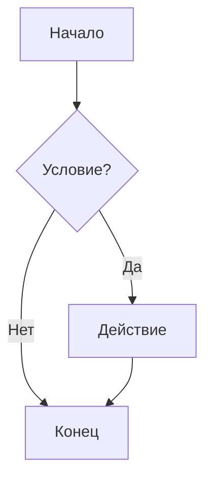
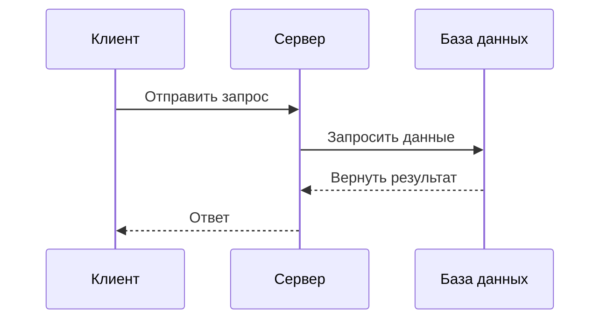
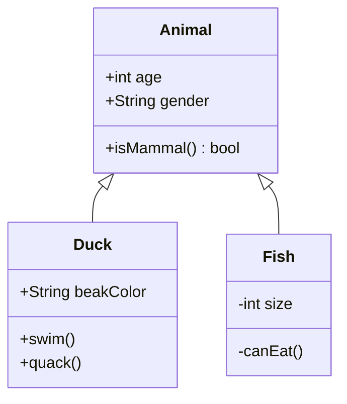
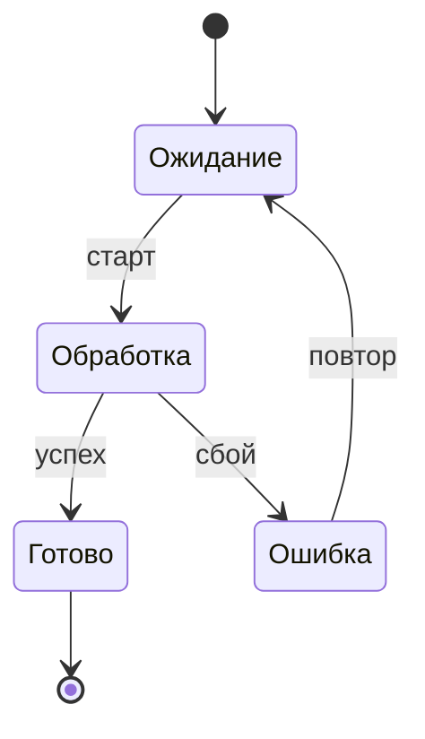

## Добро пожаловать в мой блог

Это первая статья на русском языке. Многоязычные функции настроены:

- **中文** (zh) — Язык по умолчанию
- **English** (en)
- **日本語** (ja)
- **Русский** (ru)

Блог построен на Astro 6 с поддержкой переключения тёмной/светлой темы (палитра Gruvbox) и интегрированной системой комментариев Giscus. Блоки кода поддерживают подсветку синтаксиса, отображение diff и названий файлов. Математические формулы отображаются через KaTeX — как встроенные, так и блочные.

Цель этой статьи — протестировать рендеринг всех элементов синтаксиса Markdown и проверить работу плавающего оглавления (TOC) в различных сценариях.

---

## Это чрезвычайно длинный русский заголовок, специально созданный для тестирования обрезки текста и всплывающих подсказок в компоненте TOC

Ширина TOC фиксирована — 192px, при размере шрифта 14px вмещается примерно 20–22 латинских символа. Этот заголовок значительно длиннее, поэтому в TOC он должен быть обрезан с `...`, а при наведении показан полностью.

### Столь же длинный подзаголовок третьего уровня для проверки различий в отступах при обрезке

Заголовки третьего уровня имеют дополнительный левый отступ в TOC, поэтому доступная ширина ещё меньше, и обрезка должна происходить раньше.

---

## Короткие заголовки в порядке

Ниже короткие заголовки, которые должны отображаться в TOC полностью без всплывающих подсказок.

### Короткий подзаголовок

Также отображается полностью.

---

## Тест многоуровневой иерархии заголовков

TOC включает только h2 и h3, но статья содержит более глубокие уровни для проверки рендеринга заголовков.

### Заголовок третьего уровня A

Виден в TOC с левым отступом.

#### Заголовки четвёртого уровня не попадают в TOC

Они не отображаются в TOC, но корректно рендерятся на странице.

##### Заголовки пятого уровня также не попадают

Глубокие заголовки — только для структурного тестирования.

### Заголовок третьего уровня B

Снова на уровне, видимом в TOC.

---

## Обзор синтаксиса Markdown

Этот раздел систематически тестирует различные элементы синтаксиса Markdown — от базовых стилей текста до сложных блоков кода и математических формул.

### Стили текста

Это **полужирный** текст, это *курсив*, это ***полужирный курсив***, это ~~зачёркнутый~~ текст, а это `встроенный код`.

### Ссылки и изображения

[Сайт Astro](https://astro.build/) — генератор статических сайтов, используемый в этом блоге.


### Цитаты

> Это цитата, используемая для демонстрации рендеринга блочных цитат.
>
> > Это вложенная цитата. Технически возможно, но на практике следует использовать умеренно.

---

## Списки и вёрстка

Списки — основной инструмент организации информации.

### Маркированные списки

- Пункт первый: вводный текст
- Пункт второй: ещё один момент
  - Вложенный пункт A: для уточнения
    - Более глубокая вложенность также поддерживается
  - Вложенный пункт B: ещё один подпункт
- Пункт третий: возврат на верхний уровень

### Нумерованные списки

1. Шаг первый: инициализация структуры проекта
2. Шаг второй: настройка зависимостей и параметров сборки
3. Шаг третий: написание основного кода
    1. Подшаг 3.1 — реализация слоя данных
    2. Подшаг 3.2 — реализация бизнес-логики
4. Шаг четвёртый: написание тестов для обеспечения качества кода
5. Шаг пятый: развёртывание в продакшене

### Списки задач

- [x] Выполнено: настройка проекта Astro 6
- [x] Выполнено: интеграция Tailwind CSS v4
- [ ] Сделать: добавить плавающий компонент TOC
- [ ] Сделать: оптимизировать производительность страниц
- [ ] Сделать: написать пользовательскую документацию
- [ ] Сделать: настроить CI/CD пайплайн

---

## Таблицы и отображение данных

### Базовая таблица

| Язык | Код | Шрифт | Описание |
|------|-----|-------|----------|
| Китайский | zh | Noto Sans SC | Оптимизирован для упрощённого китайского |
| Английский | en | Noto Sans | Основной шрифт для латиницы |
| Японский | ja | Noto Sans JP | Кана и кандзи |
| Русский | ru | Noto Sans | Поддержка кириллицы |

### Сравнительная таблица языков

| Возможность | JavaScript | TypeScript | Python |
|-------------|-----------|------------|--------|
| Типизация | Динамическая | Статическая | Динамическая (опциональные подсказки) |
| Среда выполнения | Браузер/Node | Компиляция в JS | Интерпретатор |
| Пакетный менеджер | npm/yarn/pnpm | npm/yarn/pnpm | pip/poetry |
| Порог вхождения | Низкий | Средний | Низкий |

---

## Блоки кода

Блоки кода используют подсветку Shiki с поддержкой: нумерации строк по умолчанию, автоматического переноса (висячий отступ), сворачивания кода (`collapse`), меток файлов (`file`) и отключения нумерации (`nolines`).

### Нумерация строк по умолчанию

Во всех блоках кода нумерация строк включена по умолчанию.

```python
def fib(n: int) -> list[int]:
    a, b = 0, 1
    result = []
    for _ in range(n):
        result.append(a)
        a, b = b, a + b
    return result
```

### Метка файла: file

`file="имя"` отображает метку с названием файла в левом верхнем углу с зелёной точкой.

```python file="fibonacci.py"
def fib(n: int) -> list[int]:
    a, b = 0, 1
    for _ in range(n):
        a, b = b, a + b
    return a
```

### Отключение нумерации: nolines

Короткие фрагменты с `nolines` скрывают нумерацию строк.

```bash nolines
pnpm install
pnpm dev
pnpm build
```

### Сворачивание кода: collapse

Блоки кода длиннее 8 строк с пометкой `collapse` автоматически сворачиваются с затемнением внизу, намекающим на продолжение. Кнопка разворачивания расположена по центру внизу.

```python collapse file="utils.py"
def fibonacci(n: int) -> list[int]:
    """Генерация первых n чисел Фибоначчи"""
    a, b = 0, 1
    result = []
    for _ in range(n):
        result.append(a)
        a, b = b, a + b
    return result


def is_prime(num: int) -> bool:
    """Проверка, является ли целое число простым"""
    if num < 2:
        return False
    for i in range(2, int(num ** 0.5) + 1):
        if num % i == 0:
            return False
    return True


def chunk_list(data: list, size: int):
    """Разбиение списка на части фиксированного размера (возвращает генератор)"""
    for i in range(0, len(data), size):
        yield data[i:i + size]


print(fibonacci(10))
primes = [x for x in fibonacci(20) if is_prime(x)]
print(f"Primes: {primes}")
```

### Сворачивание + без нумерации: collapse nolines

Несколько аннотаций можно свободно комбинировать.

```python collapse nolines
import json
from pathlib import Path


def load_config(path: str | Path) -> dict:
    """Загрузка JSON-конфигурации. Возвращает пустой словарь, если файл не найден."""
    config_path = Path(path)
    if not config_path.exists():
        return {}
    return json.loads(config_path.read_text(encoding="utf-8"))


def merge_configs(base: dict, override: dict) -> dict:
    """Глубокое слияние двух словарей конфигурации. override имеет приоритет."""
    result = base.copy()
    for key, value in override.items():
        if isinstance(value, dict) and key in result:
            result[key] = merge_configs(result[key], value)
        else:
            result[key] = value
    return result


cfg = load_config("defaults.json")
user_cfg = load_config("user.json")
final = merge_configs(cfg, user_cfg)
print(json.dumps(final, indent=2, ensure_ascii=False))
```

### Автоперенос + висячий отступ

Слишком длинные строки переносятся по границе контейнера, а продолжение выравнивается с отступом первой строки кода.

```python collapse file="dashboard.py"
def build_dashboard_report(assignments: dict[str, list[dict]], include_history: bool = False) -> str:
    """Генерация сводного отчёта на основе назначений задач по рабочим узлам."""
    lines = ["# Отчёт о нагрузке", f"Сформирован: {datetime.now().isoformat()}", ""]
    for node_name, tasks in assignments.items():
        pending = [t for t in tasks if t.get("status") == "pending" and t.get("priority", 0) >= 3]
        lines.append(f"## {node_name} ({len(pending)} высокоприоритетных задач)")
        lines.extend(f"  - [{t['priority']}] {t.get('title', 'Без названия')}" for t in sorted(pending, key=lambda x: -x["priority"]))
    if include_history:
        lines.append("\n---\n## Исторические тренды\n*Требуется включение постоянного хранилища*")
    return "\n".join(lines)


sample = [
    {"title": "Миграция данных", "status": "pending", "priority": 5, "node": "worker-0"},
    {"title": "Ротация логов", "status": "done", "priority": 1, "node": "worker-0"},
    {"title": "Перестроение индекса", "status": "pending", "priority": 4, "node": "worker-1"},
]
print(build_dashboard_report({"worker-0": sample[:2], "worker-1": sample[2:]}, include_history=True))
```

### CSS

```css nolines
.astro-code {
  @apply rounded-lg border border-border;
  font-family: var(--font-code);
}

.astro-code .line {
  min-height: 1.5rem;
}
```

---

## Mermaid-диаграммы

Блог теперь поддерживает Mermaid-диаграммы — используется тот же синтаксис огороженных блоков кода с языковым тегом `mermaid`. Диаграммы рендерятся в SVG на этапе сборки с помощью beautiful-mermaid, используя CSS-переменные для автоматической адаптации к светлой/тёмной теме.

### Блок-схема



### Диаграмма последовательности



### Диаграмма классов



### Диаграмма состояний



### Семантические цвета

Используйте `classDef` с CSS-переменными для смыслового выделения узлов, с автоматической адаптацией к светлой/тёмной теме:

```mermaid
graph TD
    Start[Начало сборки] --> Check{Проверка синтаксиса}
    Check -->|ОК| Build[Сборка артефакта]
    Check -->|Ошибка| Err[Ошибка компиляции]
    Build --> Test{Запуск тестов}
    Test -->|ОК| Deploy[Развёртывание]
    Test -->|Ошибка| Fix[Исправление кода]
    Err --> Fix
    Fix --> Check

    classDef ok fill:var(--mermaid-green),color:var(--mermaid-bg)
    classDef err fill:var(--mermaid-red),color:var(--mermaid-bg)
    classDef warn fill:var(--mermaid-yellow),color:var(--mermaid-bg)
    classDef info fill:var(--mermaid-blue),color:var(--mermaid-bg)
    class Start,Build,Deploy ok
    class Err err
    class Fix warn
    class Check,Test info
```

---

## Математические формулы

### Встроенные формулы

Эквивалентность массы и энергии $E = mc^2$ — пожалуй, самая известная физическая формула. Теорема Пифагора $a^2 + b^2 = c^2$ столь же знакома.

### Блочные формулы

Интеграл Гаусса:

$$
\int_{0}^{\infty} e^{-x^2} dx = \frac{\sqrt{\pi}}{2}
$$

Функция плотности нормального распределения:

$$
f(x) = \frac{1}{\sigma\sqrt{2\pi}} e^{-\frac{(x-\mu)^2}{2\sigma^2}}
$$

Тождество Эйлера:

$$
e^{i\pi} + 1 = 0
$$

### Многострочные формулы

С использованием окружения `aligned`:

$$
\begin{aligned}
\nabla \times \vec{\mathbf{B}} - \frac{1}{c} \frac{\partial\vec{\mathbf{E}}}{\partial t} &= \frac{4\pi}{c}\vec{\mathbf{j}} \\
\nabla \cdot \vec{\mathbf{E}} &= 4\pi\rho \\
\nabla \times \vec{\mathbf{E}} + \frac{1}{c} \frac{\partial\vec{\mathbf{B}}}{\partial t} &= \vec{\mathbf{0}} \\
\nabla \cdot \vec{\mathbf{B}} &= 0
\end{aligned}
$$

---

## Расширенные возможности

### Сноски

Это предложение со сноской.[^1] Это другое предложение со сноской.[^long-note]

[^1]: Это содержание сноски. Сноски отображаются в конце статьи.

[^long-note]: Это длинная сноска для тестирования многострочного рендеринга. В многоязычном блоге якорные ссылки сносок должны корректно обрабатывать префиксы маршрутов.

### Сворачиваемая панель HTML

<details>
<summary>Нажмите, чтобы развернуть</summary>

Это свёрнутое содержимое с поддержкой синтаксиса Markdown.

- Элемент списка
- Другой элемент
- Ещё один элемент

Сворачиваемая панель может содержать полноценный Markdown, включая блоки кода и таблицы.

</details>

### Горизонтальные разделители

---

Горизонтальный разделитель использует три или более дефиса, звёздочки или подчёркивания.

---

## Итоги и перспективы

В этой статье были систематически протестированы все элементы синтаксиса Markdown, поддерживаемые блогом. Через многоуровневую структуру заголовков проверены следующие возможности плавающего TOC:

- Определение уровней заголовков (h2 и h3)
- Отслеживание активного заголовка при прокрутке (IntersectionObserver)
- Плавная прокрутка по клику (с компенсацией смещения)
- Совместимость с многоязычным контентом

В планах на будущее — полнотекстовый поиск, облако тегов и оптимизация RSS-ленты.
