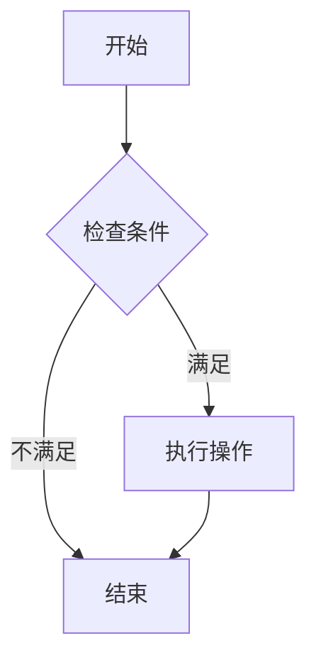
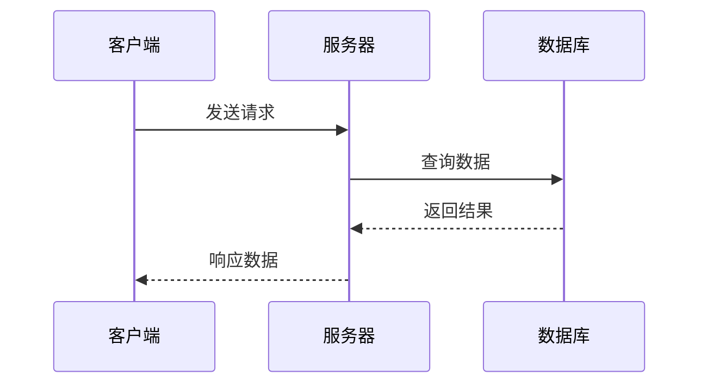
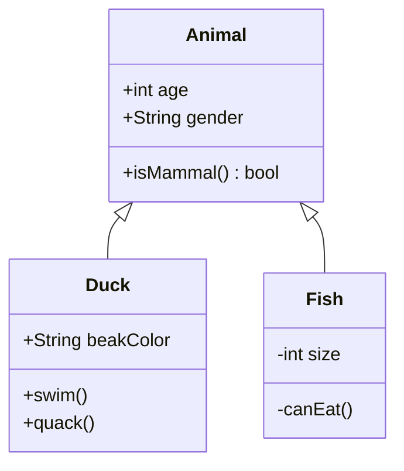
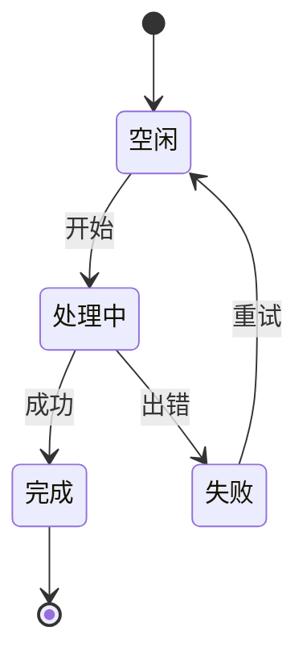

## 欢迎来到我的博客

这是第一篇中文文章。多语言功能已配置完成：

- **中文** (zh) — 默认语言
- **English** (en)
- **日本語** (ja)
- **Русский** (ru)

本博客采用 Astro 6 构建，支持暗色/亮色主题切换（Gruvbox 色板），并集成了 Giscus 评论系统。文章的代码块支持语法高亮、差异标注和文件名显示。数学公式通过 KaTeX 渲染，支持行内和块级公式。

本文旨在测试所有 Markdown 语法的渲染效果，同时验证浮动目录（TOC）组件在各种场景下的表现。

---

## 这是一个专门用于测试 TOC 组件文本截断和悬浮提示功能的超长中文标题范例

TOC 宽度固定为 192px，以14px字号计约容纳13个中文字符。本节标题远超此长度，应在 TOC 中被截断并以 `...` 省略，悬停时弹出完整标题。以下是示例正文。

### 同样很长的三级子标题用于验证不同层级在截断时的缩进表现差异

三级标题在 TOC 中有额外左缩进，实际可用宽度更窄，截断应更早发生。此处故意使用冗长的标题文字来触发溢出检测。

---

## 短标题正常

以下为短标题，TOC 中应完整显示且无 tooltip。

### 短子标题

同样完整显示。

---

## 多级标题层次测试

TOC 仅收录 h2 和 h3，但本文包含更深层级验证文章内标题渲染。

### 三级标题 A

TOC 中可见，有左缩进。

#### 四级标题不会进入 TOC

这里在 TOC 中不会出现，但页面内有正常排版。

##### 五级标题同样不进入 TOC

深层标题仅用于文章结构性测试。

### 三级标题 B

又回到 TOC 可见层级。

---

## Markdown 语法概述

本节将系统性地测试 Markdown 支持的各类语法元素。从基础文本样式到复杂的代码块和数学公式，覆盖日常写作中最常用的功能。确保每一种语法在亮色和暗色模式下都能正确渲染。

### 文本样式

这是**粗体**文本，这是*斜体*文本，这是***粗斜体***文本，这是~~删除线~~文本，这是`行内代码`。

Markdown 的文本样式非常直观。使用双星号或双下划线包裹文本即可实现粗体效果，单星号或单下划线实现斜体。三个星号可同时应用粗体和斜体。波浪线用于删除线，反引号用于行内代码显示。

此外，还可以使用 HTML 标签实现更丰富的文本效果，例如上标 X<sup>2</sup> 和下标 H<sub>2</sub>O。不过在大多数情况下，标准 Markdown 语法已经足够满足日常写作需求。

### 链接与图片

[Astro 官网](https://astro.build/) 是本博客使用的静态站点生成器。它支持岛屿架构和视图过渡 API，提供了出色的开发体验。

链接支持多种写法：行内链接 `[文本](url)`、引用式链接、以及自动链接 `<https://example.com>`。在 Astro 中，内部链接通过 `getPath()` 工具函数自动处理多语言前缀，确保在不同语言版本之间正确跳转。


### 引用

> 这是一段引用文字，用于展示 Blockquote 的渲染效果。在多语言博客中，引用的样式应该保持一致。
>
> > 这是嵌套引用。嵌套引用在技术上可行，但在实际写作中应该谨慎使用，以避免可读性下降。通常两层嵌套是极限。

引用是 Markdown 中非常实用的功能，常用于引用外部资料、标注重点内容或添加附注。在 Gruvbox 色板下，引用块会使用左侧边框和半透明文字效果。

此外，引用还可以通过 `[!TYPE]` 语法转换为警告块：

> [!NOTE]
> 这是一条备注——对读者可能有用的补充信息。

> [!TIP]
> 这是一条提示——让事情变得更好或更简单的建议。

> [!IMPORTANT]
> 这是一条重要信息——读者需要了解的关键内容。

> [!WARNING]
> 这是一条警告——需要立即注意以免出现问题。

> [!CAUTION]
> 这是一条注意——关于潜在风险或不良后果的提醒。

---

## 列表与排版

列表是组织信息的核心工具。Markdown 支持无序列表、有序列表和任务列表三种形式，每种形式都有其适用场景。

### 无序列表

无序列表使用星号、减号或加号作为标记：

- 项目一：开头内容
- 项目二：另一个要点
  - 嵌套项目 A：用于细化说明
    - 更深层的嵌套也可以支持
  - 嵌套项目 B：另一个子项
- 项目三：回到顶层

无序列表适合用于并列关系的条目，没有先后顺序的要求。在视觉上，不同层级的列表项会使用不同的标记符号（圆点、空心圆、实心方块），但这些细节由 CSS 控制。

### 有序列表

有序列表使用数字加英文句点作为标记：

1. 第一步：初始化项目结构
2. 第二步：配置依赖和构建设置
3. 第三步：编写核心功能代码
   1. 子步骤 3.1 — 实现数据层
   2. 子步骤 3.2 — 实现业务逻辑
4. 第四步：编写测试用例，确保代码质量
5. 第五步：部署到生产环境

有序列表非常适合步骤说明、排名列表和流程文档。数字会自动递增，即使你全部写 `1.` 也会正确编号。但在实际写作中，手动编号可以提高源文件的可读性。

### 任务列表

任务列表是 GitHub Flavored Markdown 的扩展：

- [x] 已完成任务：配置 Astro 6 项目
- [x] 已完成任务：集成 Tailwind CSS v4
- [ ] 待办任务：添加浮动 TOC 组件
- [ ] 待办任务：优化页面性能
- [ ] 待办任务：编写用户文档
- [ ] 待办任务：配置 CI/CD 流水线

任务列表在项目管理和文档中非常有用，可以直观地展示进度。勾选状态的切换在 GitHub 等平台上是交互式的，但在静态渲染的博客中仅为显示效果。

---

## 表格与数据展示

表格是展示结构化数据的标准方式。Markdown 使用管道符和连字符定义表格结构。

### 基础表格

| 语言 | 代码 | 字体 | 说明 |
|------|------|------|------|
| 中文 | zh | Noto Sans SC | 简体中文优化 |
| 英文 | en | Noto Sans | 拉丁字符默认字体 |
| 日文 | ja | Noto Sans JP | 日文假名和汉字 |
| 俄文 | ru | Noto Sans | 西里尔字母支持 |

表格的列宽由内容自动决定。如果需要在表格中使用管道符，可以用反斜杠转义 `\|`。表格的对齐方式通过冒号控制：左对齐（`:---`）、居中对齐（`:---:`）和右对齐（`---:`）。

### 代码对比表

| 特性 | JavaScript | TypeScript | Python |
|------|-----------|------------|--------|
| 类型系统 | 动态 | 静态 | 动态（可选类型提示） |
| 运行环境 | 浏览器/Node | 编译到 JS | 解释器 |
| 包管理 | npm/yarn/pnpm | npm/yarn/pnpm | pip/poetry |
| 学习曲线 | 低 | 中 | 低 |

---

## 代码块

代码块基于 Shiki 语法高亮，支持：默认行号、默认横向滚动、按需自动换行（`wrap`，悬挂缩进）、代码折叠（`collapse`）、文件名标签（`file`）、关闭行号（`nolines`）。

### 基础标记：行号 + file

默认开启行号；`file="名称"` 会在左上角显示文件名标签。

```python file="fibonacci.py"
def fib(n: int) -> list[int]:
    a, b = 0, 1
    for _ in range(n):
        a, b = b, a + b
    return a
```

### 关闭行号：nolines

短代码片段加 `nolines` 关闭行号，保持简洁。

```bash nolines
pnpm install
pnpm dev
pnpm build
```

### 折叠 + 横向滚动：collapse

`collapse` 自动折叠长代码块；不加 `wrap` 时，超长行仍保持单行并使用横向滚动。

```python collapse file="scroll-and-fold.py"
from datetime import datetime


def build_release_report(project: str, commits: list[dict[str, str]], include_review_notes: bool = False, timezone: str = "Asia/Shanghai") -> str:
    """生成发布报告，并刻意保留很长的函数签名用于横向滚动测试。"""
    lines = [f"# {project} 发布报告", f"生成时间: {datetime.now().isoformat()}", ""]
    for commit in commits:
        scope = commit.get("scope", "misc")
        title = commit.get("title", "未命名提交")
        lines.append(f"- [{scope}] {title} — {commit.get('hash', 'unknown')} — reviewer={commit.get('reviewer', 'none')} — deployment_window={commit.get('window', 'standard')}")
    if include_review_notes:
        lines.append("## 复核说明")
        lines.append("请确认迁移脚本、搜索索引、静态资源缓存和回滚路径都已完成验证。")
    return "\n".join(lines)


sample = [{"scope": "build", "title": "刷新 Pagefind 索引", "hash": "abc123", "reviewer": "Sylvan", "window": "nightly"}]
print(build_release_report("blog.sylvan.cafe", sample, include_review_notes=True))
```

### 自动换行 + 悬挂缩进：wrap

给代码块加 `wrap` 后，超长代码行会在容器边界自动折行，且折行缩进与首行代码对齐。

```python wrap file="wrap-example.py"
def build_query_url(endpoint: str, filters: dict[str, str], include_archived: bool = False, sort: str = "updated_at:desc") -> str:
    return f"{endpoint}?include_archived={include_archived}&sort={sort}&filters=" + "&".join(f"{key}={value}" for key, value in filters.items())
```

### CSS

```css nolines
.astro-code {
  @apply rounded-lg border border-border;
  font-family: var(--font-code);
}

.astro-code .line {
  min-height: 1.5rem;
}
```

---

## Mermaid 图表

博客现已支持 Mermaid 图表——使用和代码块相同的栅栏语法，语言标记为 `mermaid`。图表通过 beautiful-mermaid 在构建时渲染为 SVG，使用 CSS 变量自动适配亮暗主题。

### 流程图



### 时序图



### 类图



### 状态图



### 语义配色

通过 `classDef` 引用 CSS 变量，可以给节点赋予语义强调色，自动适配亮暗主题：

```mermaid
graph TD
    Start[开始编译] --> Check{检查语法}
    Check -->|通过| Build[构建产物]
    Check -->|失败| Err[编译错误]
    Build --> Test{运行测试}
    Test -->|通过| Deploy[部署上线]
    Test -->|失败| Fix[修复代码]
    Err --> Fix
    Fix --> Check

    classDef ok fill:var(--diagram-success),color:var(--diagram-bg)
    classDef err fill:var(--diagram-danger),color:var(--diagram-bg)
    classDef warn fill:var(--diagram-warning),color:var(--diagram-bg)
    classDef info fill:var(--diagram-info),color:var(--diagram-bg)
    class Start,Build,Deploy ok
    class Err err
    class Fix warn
    class Check,Test info
```

---

## 数学公式

通过 Markdown 数学管线和 KaTeX，博客支持 LaTeX 数学公式渲染。

### 行内公式

质能方程 $E = mc^2$ 可能是世界上最著名的物理公式。勾股定理 $a^2 + b^2 = c^2$ 同样是每个学生都熟悉的公式。行内公式以单个美元符号包裹，适合在段落中嵌入简单的数学表达式。

### 块级公式

高斯积分是概率论中的核心公式：

$$
\int_{0}^{\infty} e^{-x^2} dx = \frac{\sqrt{\pi}}{2}
$$

正态分布的概率密度函数：

$$
f(x) = \frac{1}{\sigma\sqrt{2\pi}} e^{-\frac{(x-\mu)^2}{2\sigma^2}}
$$

欧拉恒等式被誉为数学中最美的公式：

$$
e^{i\pi} + 1 = 0
$$

它建立了五个基本数学常数之间的联系：$e$（自然对数的底数）、$i$（虚数单位）、$\pi$（圆周率）、$1$ 和 $0$。

### 多行公式

使用 `aligned` 环境可以排版多行对齐公式：

$$
\begin{aligned}
\nabla \times \vec{\mathbf{B}} - \frac{1}{c} \frac{\partial\vec{\mathbf{E}}}{\partial t} &= \frac{4\pi}{c}\vec{\mathbf{j}} \\
\nabla \cdot \vec{\mathbf{E}} &= 4\pi\rho \\
\nabla \times \vec{\mathbf{E}} + \frac{1}{c} \frac{\partial\vec{\mathbf{B}}}{\partial t} &= \vec{\mathbf{0}} \\
\nabla \cdot \vec{\mathbf{B}} &= 0
\end{aligned}
$$

以上是麦克斯韦方程组的微分形式，它是电磁学的理论基础，统一了电学、磁学和光学。

---

## 扩展功能

本节测试一些扩展的 Markdown 和 HTML 功能，包括脚注、折叠面板和其他辅助元素。

### 脚注

这是一个带脚注的句子。[^1] 这是另一个带脚注的内容。[^long-note]

[^1]: 这是脚注内容。脚注可以在文章末尾集中显示。

[^long-note]: 这是一个长脚注，用于测试多行脚注的渲染效果。在多语言博客中，脚注的锚点链接需要正确处理路由前缀。

### HTML 折叠面板

<details>
<summary>点击展开详情</summary>

这是折叠的内容，支持 Markdown 语法。

- 列表项
- 另一项
- 还有一项

折叠面板内部可以包含完整的 Markdown 内容，包括代码块、表格等。这在需要默认隐藏详细内容时非常有用，例如：

- **技术参数说明**：对主流程无关紧要的配置选项
- **扩展阅读材料**：供有兴趣的读者深入了解
- **历史版本变更**：记录文章的历史修改

折叠状态对 SEO 没有影响，搜索引擎会索引折叠面板内的所有内容。

</details>

### 分隔线

---

分隔线使用三个或更多的连字符、星号或下划线。它通常用于表示内容上的转折或章节的划分。

---

## 总结与展望

本文系统性地测试了博客支持的所有 Markdown 语法。通过多层级标题结构，验证了浮动 TOC 组件的以下功能：

- 标题层级识别（h2 和 h3）
- 滚动高亮跟随（IntersectionObserver）
- 点击平滑跳转（带偏移量补偿）
- 多语言内容兼容

本博客将持续迭代改进，后续计划增加的功能包括全文搜索、标签云和 RSS 订阅优化。欢迎通过 Giscus 评论系统提供反馈和建议。

---
